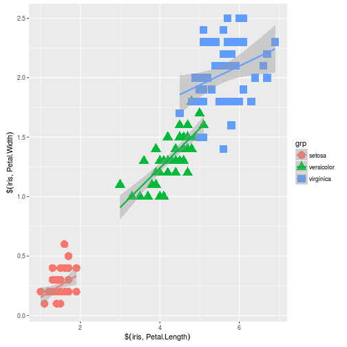

```
## Error in eval(expr, envir, enclos): object 'opts_chunk' not found
```


# R programming basics
This presentation will cover, how to create your own functions, and how to use basic programming control structures.  I am assuming basic familiarity with R and R function syntax.  In particular we will cover:

- [`function()`](#functions-and-programming-with-r)
- [if-else statements](#if-else)
- [for loops](#for)


***note:*** These materials were borrowed liberally from the [US EPA Intro to R workshop: Lesson 8](http://usepa.github.io/introR/2015/01/15/08-Repeat-Reproduce/)

## Functions and Programming with R
We know quite a bit about functions.  They have a name, some arguments, and they do something.  Some return a value, some don't.  In short they form the basic structure of R.  One of the cool things about R (and programming in general), is that we are not stuck with the functions provided to us.  We can (and should!) develop our own as we often want to do things repeatedly, and in slightly different contexts.  Creating a function to deal with this fact helps us a great deal because we do not have to repeat ourselves, we can just use what we have already written.  Creating a function is really easy.  We use the `function()` function.  It has the basic structure of: 


```
function_name <- function(arguments){
  code goes here
  use arguments as needed
}
```
So a real example, without arguments might look like:


```r
hw <- function(){
  print("Hello, World")
}

hw()
```

```
## [1] "Hello, World"
```

Well that's nice...  Not really useful, but shows the main components, `function()`, and the `{}` which are really the only new things.  Also,  each function comes with some basic information attached to it and have functions associated with them.  These are the `formals()`, the `body()`, and the `environment()`.  

The `formals()` returns the argument list.  Our function doesn't have any arguments so we get `NULL` back. 


```r
formals(hw)
```

```
## NULL
```

The `body()` is the code that sits inside of the outermost `{}`.  So for `hw()` we get:


```r
body(hw)
```

```
## {
##     print("Hello, World")
## }
```

The `environment()` describes the names and objects in memory you have access to.  We aren't going to go into this today. 

The two pieces of the functions we will focus on are the formals (I'll call them arguments) and the body.

Lets add some arguments to make our function a bit better and  more flexible. For example,


```r
p <- function(my_text){
  print(my_text)
}

p("Hello, world")
```

```
## [1] "Hello, world"
```

```r
p("Hola, mundo")
```

```
## [1] "Hola, mundo"
```

```r
p("Howdy, Texas")
```

```
## [1] "Howdy, Texas"
```

This is of course a bit of a silly example.  Functions are useful when we want to combine many other functions together that do something useful that we might want to repeat.  For example, maybe we had a plot that we wanted to re-create with different data and save the output.  A function that does this might look like:


```r
myplot <- function(x,y,grp,file){
  my_p <- ggplot(data.frame(x,y,grp),aes(x=x,y=y)) +
            geom_point(aes(color=grp, shape=grp),size=5) +
            geom_smooth(method="lm",aes(colour=grp))+
            labs(x=substitute(x),y=substitute(y))
  ggsave(my_p,file=file)
  return(my_p)
}

myplot(iris$Petal.Length,iris$Petal.Width,iris$Species,"petal_petal.jpg")
```

```
## Saving 7 x 7 in image
```



```r
myplot(iris$Sepal.Length,iris$Sepal.Width,iris$Species,"sepal_l_petal_w.jpg")
```

```
## Saving 7 x 7 in image
```


Cool, a function, that does something useful.  It still is just a collection of functions at this point though.  What if we wanted to repeat something or have the function make some decisions and do one thing given a set of criteria and something else for a different set?  Well we need to look more at some of the classic programming structures in R.  For this introduction, I am going to look just at `if-else` statements and `for` loops (some in the R world think this to be bad since R is optimized for working on vectors, but I think the concept useful and I'm writing this, so there!).  

### if-else
If you have done any programing in any language, then `if-else` statements are not new to you.  All they do is allow us to tell the function how to make some decisions.  

I will show the examples in the context of a function as that is how they are most commonly used. So, we can implement them in R like:


```r
odd_even <- function(num){
  if(num %% 2 == 0){
    print("EVEN")
  } else {
    print("ODD")
  }
}

odd_even(27)
```

```
## [1] "ODD"
```

```r
odd_even(34)
```

```
## [1] "EVEN"
```

And you can you use multiple `if` statements


```r
plus_minus <- function(num){
  if(num>0){
    print("plus")
  } else if (num < 0) {
    print("minus")
  } else {
    print("zero")
  }
}
 
plus_minus(198)
```

```
## [1] "plus"
```

```r
plus_minus(-44)
```

```
## [1] "minus"
```

```r
plus_minus(37*0)
```

```
## [1] "zero"
```

## for
A `for` loop allows you to repeat code.  You specify a variable and a range of values and the `for` loop runs the code for each value in your range.  The basic structure looks like:

```
for(a_name in a_range){
 code you want to run
 may or may not use a_name
}
```

And an example in a function.


```r
p_vec <- function(vec){
  for(i in vec){
    print(i)
  }
}

p_vec(1:2)
```

```
## [1] 1
## [1] 2
```

```r
p_vec(letters)
```

```
## [1] "a"
## [1] "b"
## [1] "c"
## [1] "d"
## [1] "e"
## [1] "f"
## [1] "g"
## [1] "h"
## [1] "i"
## [1] "j"
## [1] "k"
## [1] "l"
## [1] "m"
## [1] "n"
## [1] "o"
## [1] "p"
## [1] "q"
## [1] "r"
## [1] "s"
## [1] "t"
## [1] "u"
## [1] "v"
## [1] "w"
## [1] "x"
## [1] "y"
## [1] "z"
```
But it'd be nice to do something besides print the values to the screen.  We could create our own sum function.


```r
sum_vec <- function(vec){
  j <- 0
  for(i in vec){
    j <- i+j
    print(j)
  }
}

sum_vec(1:2)
```

```
## [1] 1
## [1] 3
```

```r
sum_vec(1:10)
```

```
## [1] 1
## [1] 3
## [1] 6
## [1] 10
## [1] 15
## [1] 21
## [1] 28
## [1] 36
## [1] 45
## [1] 55
```
Again a bit of a silly example since all it is doing is looping through a list of values and summing it.  In reality you would just use `sum()`.  This also highlights the fact that loops in R can be slow compared to vector operations and/or primitive operations (see Hadley's section on [Primitive functions](http://adv-r.had.co.nz/Functions.html#function-components)).  

We can also use loops to repeat some operations.  Perhaps a bootstrapped sample?


```r
mean_boot  <-  function(vec, R=100){
  out <- NULL
  for(i in 1:R){
    out[i] <- mean(sample(vec,length(vec),replace=T))
  }
  median(out)
}

mean_boot(rnorm(100))
```

```
## [1] -0.1053921
```

```r
mean_boot(iris$Petal.Length,R=5000)
```

```
## [1] 3.755333
```

Lastly, let's dig a bit more into the timing issue with another example (using the `sum()` example is a bit unfair since `sum()` is actually implemented in C).  This time, let's look at adding two vectors together.  We haven't touched on this yet, but R is really good at dealing with this kind of operation.  It is what people mean when they talk about "vectorized" operations.  For instance:


```r
# A simple vectorized operation
x <- 1:100
y <- 100:1
z <- x+y
z
```

```
##   [1] 101 101 101 101 101 101 101 101 101 101 101 101 101 101 101 101 101
##  [18] 101 101 101 101 101 101 101 101 101 101 101 101 101 101 101 101 101
##  [35] 101 101 101 101 101 101 101 101 101 101 101 101 101 101 101 101 101
##  [52] 101 101 101 101 101 101 101 101 101 101 101 101 101 101 101 101 101
##  [69] 101 101 101 101 101 101 101 101 101 101 101 101 101 101 101 101 101
##  [86] 101 101 101 101 101 101 101 101 101 101 101 101 101 101 101
```

Pretty cool.  This kind of thing doesn't come easily with many languages.  You would need to program it yourself using a loop.  For the sake of argument, let's try that with R.


```r
#We will assume vectors of the same length...
add_vecs <- function(vec1,vec2){
  out <- NULL
  for(i in 1:length(vec1)){
    out[i] <- vec1[i]+vec2[i]
  }
  out
}
add_vecs(x,y)
```

```
##   [1] 101 101 101 101 101 101 101 101 101 101 101 101 101 101 101 101 101
##  [18] 101 101 101 101 101 101 101 101 101 101 101 101 101 101 101 101 101
##  [35] 101 101 101 101 101 101 101 101 101 101 101 101 101 101 101 101 101
##  [52] 101 101 101 101 101 101 101 101 101 101 101 101 101 101 101 101 101
##  [69] 101 101 101 101 101 101 101 101 101 101 101 101 101 101 101 101 101
##  [86] 101 101 101 101 101 101 101 101 101 101 101 101 101 101 101
```

So, these do the same thing, big deal.  It is big though when you look at the timing of the two.  Let's create two large vectors and see what happens.


```r
large_vec1 <- as.numeric(1:100000)
large_vec2 <- as.numeric(100000:1)
#Different speed
vec_time <- system.time(large_vec1+large_vec2)
loop_time <- system.time(add_vecs(large_vec1,large_vec2))
vec_time
```

```
##    user  system elapsed 
##   0.001   0.000   0.000
```

```r
loop_time
```

```
##    user  system elapsed 
##  22.049   0.000  21.940
```

Wow, quite a difference in time! It is examples like this that lead to all the talk around why R is slow at looping.  In general I agree that if there is an obvious vectorized/base solution (in this case simply adding the two vectors) use that.  That being said, it isn't always obvious what the vectorized solution would be. In that case there are some easy things to do to speed this up.  With loops that write to an object and that object is getting re-sized, we may also know the final size of that object so we can do one simple thing to dramatically improve perfomance: pre-allocate your memory, like this:


```r
#We will assume vectors of the same length...
add_vecs2 <- function(vec1,vec2){
  out <- vector("numeric",length(vec1))
  for(i in 1:length(vec1)){
    out[i] <- vec1[i]+vec2[i]
  }
  out
}

system.time(add_vecs2(large_vec1,large_vec2))
```

```
##    user  system elapsed 
##   0.168   0.000   0.109
```

Now thats better.  In short, if an obvious vector or primitive solution exists, use that.  If those aren't clear and you need to use a loop, don't be afraid to use one.  There are plenty of examples where a vectorized solution exists for a loop, but it may be difficult to code and understand.  Personally, I think it is possible to go too far down the vectorized path.  Do it when it makes sense, otherwise take advantage of the for loop! You can always try and speed things up after you have got your code working the first time.


## Exercise 1
For this exercise we are going to practice with functions and some of the control structures.

1. Our first task is to create a simple function.  This one is a bit contrived, but wanted let you try it first before we work on our NLA data.  Create a function that allows you to calculate the mean or standard deviation (hint: sd()) of an input vector.
2. Our second task is going to be to take your last `ggplot2` plot, and turn that into a function.  The function should take an x and y as input, and have an optional argument for a file name to save it as an image.  Depending on how complex your plot was you may need to add in some additional arguments.  To help things along, I have provided some starter code:


```r
plot_nla <- function(x,y,out=NULL){
  #ggplot2 code
  #Note: ggplot requires a data frame as input.  How would you deal with that?
  
  #ggsave here
  #look into the is.null() function
  if(put condition here){
    ggsave()
  }
  
  #Need to return something ...
  
}
```
